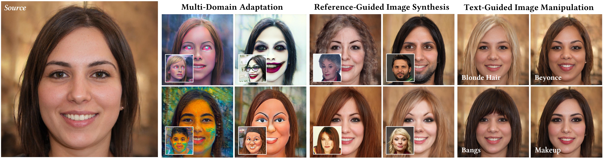

Generative Adversarial Networks (GANs), particularly StyleGAN and its variants, have demonstrated remarkable capabilities in generating highly realistic images. Despite their success, adapting these models to diverse tasks such as domain adaptation, reference-guided synthesis, and text-guided manipulation with limited training data remains challenging. Towards this end, in this study, we present a novel framework that significantly extends the capabilities of a pre-trained StyleGAN by integrating CLIP space via hypernetworks. This integration allows dynamic adaptation of StyleGAN to new domains defined by reference images or textual descriptions. Additionally, we introduce a CLIP-guided discriminator that enhances the alignment between generated images and target domains, ensuring superior image quality. Our approach demonstrates unprecedented flexibility, enabling textguided image manipulation without the need for text-specific training data and facilitating seamless style transfer. Comprehensive qualitative and quantitative evaluations confirm the robustness and superior performance of our framework compared to existing methods.

[Download paper here](https://cyberiada.github.io/HyperGAN-CLIP/)
